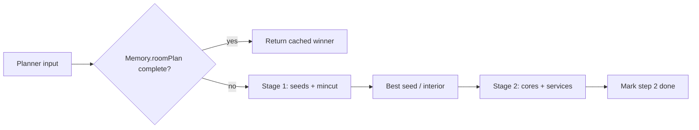

# KBv4 room planner

LLm model(s) used: Composer 2.5, Codex 5.2/5.3

Two-stage **Screeps** room layout planner for kbv4

Entry point: `index.js` (also re-exported as `planner.js`).

```js
const { planner, ROOM_PLAN_LAYOUT_KEYS } = require("./planner");

const result = planner({
  roomName: "W1N1",
  terrain: Game.map.getRoomTerrain("W1N1"),
  source1_pos: { x: 10, y: 15 },
  source2_pos: { x: 40, y: 20 }, // or null
  controller_pos: { x: 25, y: 25 },
  mineral_pos: { x: 30, y: 30 },
  spawn1_pos: null, // optional; used for respawn planning (wip)
  type: 1, // (wip)
});
```

## Pipeline



### Stage 1 — interior and mincut

1. **Distance transform** from walls and exit buffer (`lib/terrain.js`).
2. **Seed extraction** at distance 4 from walls (`stage1/seeds.js`).
3. **Per-seed evaluation** (`stage1/evaluate.js`): max-flow mincut, interior connectivity, buildable area, hub/fastfiller fit checks (`stage1/coreAreas.js`, `stage1/mincut.js`).
4. **Winner selection** — lowest mincut size among valid seeds; prefer controller-adjacent protection within +10 tiles of the minimum (`index.js`).

Stage 1 is **CPU-budgeted** (~300 CPU/tick) and **resumable** when `Game.cpu.bucket` is below 500. Progress is stored on `Memory.roomPlan[roomName].stage1Progress` until all seeds are scored.

### Stage 2 — structure layout

Runs only after a stage-1 winner is stored:

| Step | Module | Output |
|------|--------|--------|
| Hub + fastfiller cores | `step2/corePlacement.js` | Spawn, storage, terminal, links, fastfiller tiles |
| Service sites | `step2/serviceSites.js` | Towers, labs, extensions, roads, containers, ramparts |
| Access repair | `step2/accessibility.js`, `step2/placementAccess.js` | Reachability fixes for labs/extensions |
| Path costs | `step2/accessCost.js`, `step2/roads.js` | Strict / road-only routing (no import cycles) |

Core patterns live in `layouts.js` (`HUB_CORE_GRID`, `FASTFILLER_CORE_GRID`).

## Planner result

`planner(input)` returns an object (see `buildPlannerResult` in `index.js`):

| Field | Meaning |
|-------|---------|
| `ok` | A usable winner exists |
| `input` | Normalized planner input |
| `winner` | Stage-1 `SeedEvaluation` (mincut, interior, buildable tiles) |
| `corePlan` / `servicePlan` | Stage-2 placements when step 2 ran this tick |
| `cached` | Restored from `Memory.roomPlan` without recomputing |
| `mincutDone` | Stage 1 complete for this room |
| `step2Done` | Full layout persisted (`a === 2`) |
| `stage1InProgress` | More seeds remain; call again next tick |

Input validation is in `input.js` (`normalizePlannerInput`).

## Memory: `Memory.roomPlan`

Compact per-room plan (`stage1/roomPlan.js`, key map in `layouts.js`):

- **`a`** — `1` = mincut done, `2` = step-2 layout done (planner stops replanning)
- **`b`** / **`c`** — packed mincut and interior tile coords `(y << 6) | x`
- **`d`–`x`** — step-2 arrays by structure type (tower, extension, spawn, road, rampart variants, etc.)

`ROOM_PLAN_LAYOUT_KEYS` maps logical names (`tower`, `extension`, `road`, …) to single-letter keys.

## Debug visualization

Toggle flags in `constants.js` (uses `RoomVisual` via `debug/visualize.js`):

- `DEBUG_VISUALIZE_DISTANCE_TRANSFORM`
- `DEBUG_VISUALIZE_SEEDS`
- `DEBUG_VISUALIZE_MINCUT_AND_INTERIOR`
- `DEBUG_VISUALIZE_ALTERNATIVE_MINCUTS`
- `DEBUG_VISUALIZE_STEP2_CORES`
- `DEBUG_VISUALIZE_PROGRESS`

## Module map

| Path | Role |
|------|------|
| `index.js` | Orchestrates stage 1 + step 2, winner pick, CPU budgets |
| `input.js` | Input normalization and validation |
| `constants.js` | Costs, radii, mincut limits, debug flags |
| `layouts.js` | Core grids, visual colors, `ROOM_PLAN_LAYOUT_KEYS` |
| `types.js` | JSDoc typedefs (`PlannerInput`, `RoomPlanCompact`, …) |
| `stage1/seeds.js` | Seed extraction from distance map |
| `stage1/evaluate.js` | Per-seed mincut + interior + buildable evaluation |
| `stage1/mincut.js` | Max-flow mincut solver |
| `stage1/coreAreas.js` | Hub/fastfiller area candidate search |
| `stage1/roomPlan.js` | Read/write `Memory.roomPlan`, stage-1 resume |
| `step2/corePlacement.js` | Hub + fastfiller placement |
| `step2/serviceSites.js` | Towers, labs, extensions, roads, ramparts |
| `step2/towers.js` / `labs.js` / `extensions.js` | Structure-specific placement |
| `step2/roads.js` / `routingMask.js` | Road routing and masks |
| `step2/accessCost.js` | Path cost matrices (no step2 cycles) |
| `step2/placementAccess.js` | Lab/extension reachability repair |
| `step2/accessibility.js` | Final service road accessibility |
| `step2/persist.js` | Pack placements into compact memory |
| `lib/mask.js` | Bitmasks, connectivity, packing |
| `lib/geo.js` | Distances, sorting, coordinates |
| `lib/terrain.js` | Distance transform, passable/cost matrices |
| `debug/visualize.js` | RoomVisual helpers |

## Future version todo

| Stampless mode | No fastfiller and hub ( or hub only ), plan completely stampless to fit narrower rooms |
| Road post process | Optimize roads, remote reduntant roads and replace blockers with road for better connectivity |
| More scoring factor | factors other than mincut tiles, like distance to remote sources |
| Adjacent room aware planning | Allow input of adjacent room terrain and static intel to plan remote at the same time |

